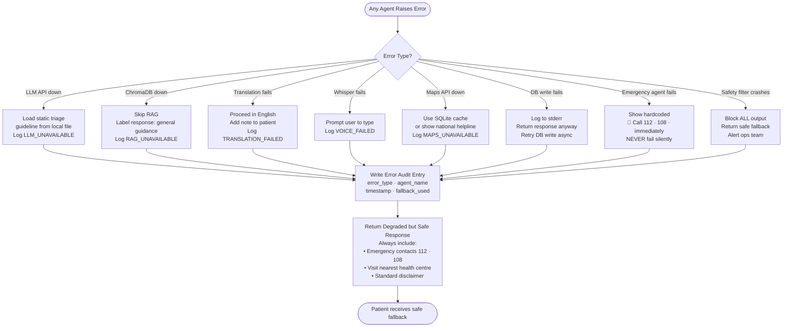
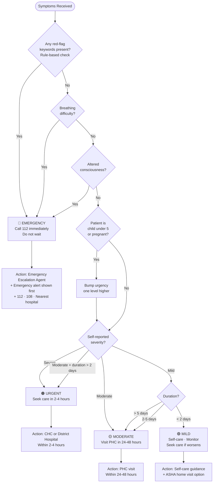
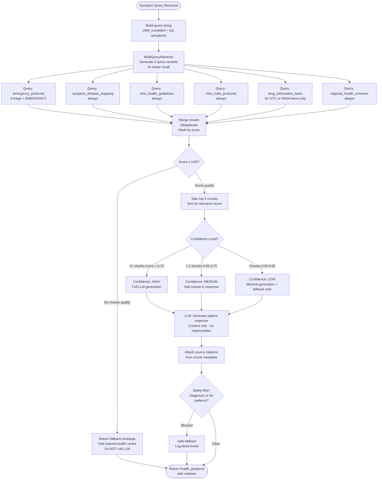
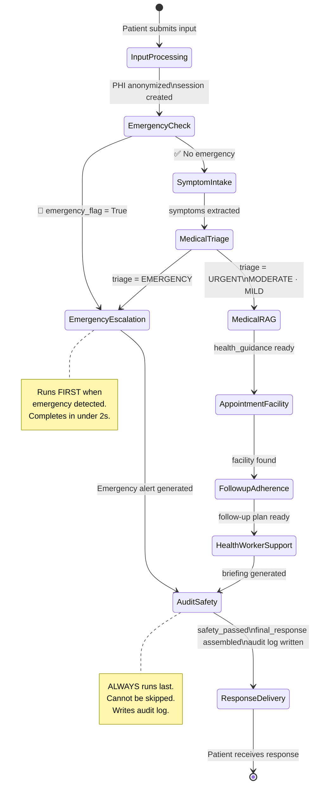

# FLOWCHART.md — RuralCare AI Complete Process Flow

Render this file in VS Code (Markdown Preview with Mermaid extension), GitHub, or paste into https://mermaid.live

---

## Full System Workflow Diagram

```mermaid
flowchart TD

    %% ═══════════════════════════════════════════════════
    %% PHASE 0 — PATIENT ENTRY
    %% ═══════════════════════════════════════════════════

    START([🏥 Patient Interaction Begins])
    START --> INPUT_TYPE{Input Channel?}
    INPUT_TYPE -->|Voice Upload .wav/.mp3| WHISPER[Whisper STT\nTranscribe Audio Locally]
    INPUT_TYPE -->|Text Entry| RAW_TEXT[Raw Text Input\nvia Streamlit / API]

    %% ═══════════════════════════════════════════════════
    %% PHASE 1 — INPUT PRE-PROCESSING
    %% ═══════════════════════════════════════════════════

    subgraph PRE [Phase 1 · Input Pre-Processing]
        direction TB

        WHISPER --> STT_OK{Transcription\nSuccessful?}
        STT_OK -->|No — audio corrupt\nor model unavailable| VOICE_FAIL[/⚠️ Prompt: Please type\nyour symptoms instead/]
        STT_OK -->|Yes| LANG_DETECT

        RAW_TEXT --> LANG_DETECT[Language Detection\nlangdetect library]
        VOICE_FAIL -.->|User retypes| RAW_TEXT

        LANG_DETECT --> IS_EN{Language\n= English?}
        IS_EN -->|Yes| PHI_ANON
        IS_EN -->|No — Indic| INDICTR[IndicTrans2\nOffline Translation]
        IS_EN -->|No — Other| GOOGLETR[Google Translate API\nCloud Translation]

        INDICTR --> XLAT_OK{Translation\nSuccessful?}
        GOOGLETR --> XLAT_OK
        XLAT_OK -->|Fail — API down\nor model missing| XLAT_FALLBACK[Proceed in English\nAdd language note to response]
        XLAT_OK -->|Yes| PHI_ANON
        XLAT_FALLBACK --> PHI_ANON

        PHI_ANON[PHI Anonymization\nStrip names · phones · IDs\nAssign Patient Token PT-xxxxxxxx]
        PHI_ANON --> SESSION_INIT[Session Initialisation\nGenerate session_id · timestamp\naudit_log = empty list]
    end

    %% ═══════════════════════════════════════════════════
    %% PHASE 2 — EMERGENCY KEYWORD CHECK
    %% ═══════════════════════════════════════════════════

    SESSION_INIT --> EMERG_CHECK{🚨 Emergency Keyword Check\nRule-based · No LLM · Under 100ms\n\nchest pain · cannot breathe · unconscious\nseizure · stroke · severe bleeding\nsnake bite · eclampsia · baby not breathing}

    %% ═══════════════════════════════════════════════════
    %% EMERGENCY FAST PATH
    %% ═══════════════════════════════════════════════════

    subgraph EMERG_PATH [Emergency Fast Path — Target Under 2 Seconds Total]
        direction TB

        EA1[7. Emergency Escalation Agent\nRuns BEFORE all other agents]
        EA1 --> EA2[Identify Emergency Type\nAirway · Cardiac · Neurological\nBleeding · Poison · Obstetric]
        EA2 --> EA3[Query emergency_protocols\nChromaDB — Top 3 chunks · score ≥ 0.60]
        EA3 --> EA4{Relevant Docs\nFound?}
        EA4 -->|Yes| EA5[Generate First Aid Guidance\nRAG-grounded · Direct · Clear]
        EA4 -->|No — ChromaDB down| EA6[Load Hardcoded Static\nFirst Aid from local file\nAlways available in memory]
        EA5 --> EA7[Assemble Emergency Alert\n🚨 Call 112 · Ambulance 108\nNearest Emergency Facility\nStep-by-step First Aid]
        EA6 --> EA7
        EA7 --> EA8{Production\nMode?}
        EA8 -->|Yes| EA9[Send Webhook Alert\nHealth worker · District health officer]
        EA8 -->|No — Demo mode| EA10[Skip webhook\nLog demo note]
        EA9 --> EA11[Write EMERGENCY Audit Entry\nemergency_flag=true · triage=EMERGENCY]
        EA10 --> EA11
    end

    EMERG_CHECK -->|🚨 Emergency Detected| EA1

    %% ═══════════════════════════════════════════════════
    %% NORMAL AGENT PIPELINE
    %% ═══════════════════════════════════════════════════

    EMERG_CHECK -->|✅ No Emergency Keywords| AGT1_START

    subgraph NORMAL [Normal Agent Pipeline]
        direction TB

        %% ── Agent 1: Symptom Intake ──────────────────────────────
        AGT1_START[1. Symptom Intake Agent]
        AGT1_START --> AGT1_LLM[LLM Call — Symptom Extraction\nSystem prompt: extract only · no diagnosis\nOutput: strict JSON]
        AGT1_LLM --> AGT1_VALID{Valid JSON\nOutput?}
        AGT1_VALID -->|No| AGT1_RETRY[Retry Once\nExplicit JSON format prompt]
        AGT1_RETRY --> AGT1_RETRY2{Retry\nSuccessful?}
        AGT1_RETRY2 -->|No| AGT1_FB[Fallback: Use raw input\nas chief_complaint\nseverity = moderate]
        AGT1_RETRY2 -->|Yes| AGT1_DONE
        AGT1_VALID -->|Yes| AGT1_DONE[Symptoms Structured\nchief_complaint\nsymptoms list\nduration · severity]
        AGT1_FB --> AGT1_DONE
        AGT1_DONE --> AGT1_AUDIT[📋 Audit Entry: symptom_intake]

        %% ── Agent 2: Medical Triage ──────────────────────────────
        AGT1_AUDIT --> AGT2[2. Medical Triage Agent]
        AGT2 --> AGT2_FLAG{emergency_flag\nalready = True?}
        AGT2_FLAG -->|Yes — rule-based override| AGT2_FORCE[Force EMERGENCY\nNo LLM call · Rule overrides LLM]
        AGT2_FLAG -->|No| AGT2_LLM[LLM Call — Classify Urgency\nWHO triage principles\nConservative bias if uncertain]
        AGT2_LLM --> AGT2_VALID{Valid Triage Level?\nEMERGENCY · URGENT\nMODERATE · MILD}
        AGT2_VALID -->|Invalid output| AGT2_DEF[Default to URGENT\nConservative safety bias]
        AGT2_VALID -->|Valid| AGT2_SET
        AGT2_FORCE --> AGT2_SET
        AGT2_DEF --> AGT2_SET[Triage Level Confirmed\n+ Reasoning text\n+ Recommended care setting]
        AGT2_SET --> AGT2_ROUTE{triage_level\n= EMERGENCY?}
        AGT2_ROUTE -->|Yes — escalate| AGT2_ESC[Also trigger Emergency\nEscalation Agent in parallel]
        AGT2_ROUTE -->|No| AGT2_AUDIT
        AGT2_ESC --> AGT2_AUDIT
        AGT2_SET --> AGT2_AUDIT[📋 Audit Entry: medical_triage]

        %% ── Agent 3: Medical RAG ─────────────────────────────────
        AGT2_AUDIT --> AGT3[3. Medical RAG Agent]
        AGT3 --> AGT3_QUERY[Build RAG Query\nchief_complaint + symptom list\nNo PHI in query]
        AGT3_QUERY --> AGT3_CHROMA[Query ChromaDB\n6 Collections in priority order\nMultiQueryRetriever · k=5 · score ≥ 0.65]
        AGT3_CHROMA --> AGT3_FOUND{Documents\nFound Above\nThreshold?}
        AGT3_FOUND -->|None meet threshold| AGT3_FB[Return Fallback\nVisit nearest health centre\nLabel: general guidance]
        AGT3_FOUND -->|Yes| AGT3_LLM[LLM Call — Generate Guidance\nContext-only · Grade 6 reading level\nNo disease names · No Rx]
        AGT3_LLM --> AGT3_SF{Safety Filter\nDiagnosis or Prescription\nPatterns Detected?}
        AGT3_SF -->|Blocked| AGT3_BLOCK[Replace with Safe Fallback\nLog blocked_reason\nsafety_passed = False]
        AGT3_SF -->|Clear| AGT3_CITE{RAG Sources\nCited in Output?}
        AGT3_CITE -->|No| AGT3_ADD[Add source citations\nfrom retrieved docs]
        AGT3_CITE -->|Yes| AGT3_DONE
        AGT3_ADD --> AGT3_DONE
        AGT3_FB --> AGT3_DONE
        AGT3_BLOCK --> AGT3_DONE[health_guidance text\nrag_sources list\ngrounding_confidence level]
        AGT3_DONE --> AGT3_AUDIT[📋 Audit Entry: medical_rag]

        %% ── Agent 4: Appointment & Facility ─────────────────────
        AGT3_AUDIT --> AGT4[4. Appointment and Facility Agent]
        AGT4 --> AGT4_MAP[Map Triage Level → Facility Type\nEMERGENCY → District Hospital\nURGENT → CHC\nMODERATE → PHC\nMILD → Sub-Centre or ASHA]
        AGT4_MAP --> AGT4_MODE{Demo Mode?}
        AGT4_MODE -->|Yes| AGT4_CACHE[Query SQLite Facility Cache\nby district + state]
        AGT4_MODE -->|No| AGT4_GEO[Geocode Location\nOpenStreetMap Nominatim]
        AGT4_GEO --> AGT4_OSM[Overpass API Query\nFind healthcare POIs\nWithin 10km radius]
        AGT4_CACHE --> AGT4_FOUND{Facilities\nFound?}
        AGT4_OSM --> AGT4_FOUND
        AGT4_FOUND -->|No| AGT4_NOFAC[Return District Hospital\n+ National Helpline\n112 · 108]
        AGT4_FOUND -->|Yes| AGT4_RANK[Rank Results\nGovernment first\nSort by distance\nFilter by services needed]
        AGT4_RANK --> AGT4_REC[Select Recommended Facility\nTop match for triage level]
        AGT4_NOFAC --> AGT4_AUDIT
        AGT4_REC --> AGT4_AUDIT[📋 Audit Entry: appointment_facility]

        %% ── Agent 5: Follow-up & Adherence ──────────────────────
        AGT4_AUDIT --> AGT5[5. Follow-up and Adherence Agent]
        AGT5 --> AGT5_LEVEL{Triage Level?}
        AGT5_LEVEL -->|EMERGENCY| AGT5_E[Post-emergency follow-up\nAfter care is received]
        AGT5_LEVEL -->|URGENT| AGT5_U[Follow up: 4-6 hours\nHigh priority]
        AGT5_LEVEL -->|MODERATE| AGT5_M[Follow up: 24-48 hours\nMonitor closely]
        AGT5_LEVEL -->|MILD| AGT5_ML[Follow up: 3-7 days\nSelf-monitor with guidance]
        AGT5_E --> AGT5_BUILD
        AGT5_U --> AGT5_BUILD
        AGT5_M --> AGT5_BUILD
        AGT5_ML --> AGT5_BUILD
        AGT5_BUILD[Build Follow-up Plan\nwatch_for symptoms\nreturn_immediately_if triggers\nhome_care instructions\nreminder schedule] --> AGT5_DB[Write Reminders to DB\nfollowup_reminders table]
        AGT5_DB --> AGT5_OK{DB Write\nSuccessful?}
        AGT5_OK -->|Fail| AGT5_ERR[Log DB Error\nInclude plan in response anyway\nRetry async]
        AGT5_OK -->|Yes| AGT5_DONE
        AGT5_ERR --> AGT5_DONE[Follow-up plan ready\nReminders scheduled]
        AGT5_DONE --> AGT5_AUDIT[📋 Audit Entry: followup_adherence]

        %% ── Agent 6: Health Worker Support ───────────────────────
        AGT5_AUDIT --> AGT6[6. Health Worker Support Agent]
        AGT6 --> AGT6_BUILD[Generate ASHA / ANM / CHW Briefing Note\nPatient token · Triage level · Key symptoms\nRecommended action · Scheme eligibility\nFollow-up schedule]
        AGT6_BUILD --> AGT6_SCHEME[Attach Relevant Government Schemes\nPM-JAY · JSSK · RBSK · NHM Free Drug\nNational Iron Plus · Ayushman Bharat]
        AGT6_SCHEME --> AGT6_AUDIT[📋 Audit Entry: health_worker_support]
    end

    %% ═══════════════════════════════════════════════════
    %% PHASE 3 — SAFETY, AUDIT & RESPONSE ASSEMBLY
    %% ═══════════════════════════════════════════════════

    subgraph SAFETY [Phase 3 · Safety · Audit · Response Assembly — ALWAYS RUNS LAST]
        direction TB

        SA1[8. Audit Safety and Compliance Agent\nMandatory Final Gate]
        SA1 --> SA2[Run Safety Filter on all\npatient-facing text]

        SA2 --> SA3{Diagnosis\nPatterns Found?\nyou have X · this is X\nyou seem to have}
        SA3 -->|Detected| SA3B[Block Output\nLog blocked_reason\nsafety_passed = False\nReplace with safe fallback]
        SA3 -->|Clear| SA4{Prescription\nPatterns Found?\ndosage · drug names\ntwice daily}
        SA3B --> SA8

        SA4 -->|Detected| SA4B[Block Output\nLog blocked_reason\nReplace with safe fallback]
        SA4 -->|Clear| SA5{PHI Detected\nin Response?\nname · phone · Aadhaar}
        SA4B --> SA8

        SA5 -->|Found| SA5B[Strip PHI from response\nLog privacy event]
        SA5 -->|Clear| SA6{Disclaimer\nPresent?}
        SA5B --> SA6

        SA6 -->|Missing| SA6B[Inject Standard Disclaimer\nRuralCare AI is NOT a doctor\nCall 112 for emergencies]
        SA6 -->|Present| SA7{RAG Sources\nCited?}
        SA6B --> SA7

        SA7 -->|Missing| SA7B[Add: general guidance label\nSource: general health information]
        SA7 -->|Present| SA8
        SA7B --> SA8

        SA8[Assemble Final Patient Response\n1 Emergency Alert if applicable\n2 Triage Level and Reasoning\n3 Health Guidance with Sources\n4 Recommended Facility\n5 Follow-up Plan Summary\n6 Standard Disclaimer]

        SA8 --> SA9[Write Final Audit Log\nto audit_logs table\nInput hash SHA-256\nOutput hash SHA-256\nsafety_passed · timestamp\ntoken_count · latency_ms]
    end

    EA11 --> SA8
    AGT6_AUDIT --> SA1

    %% ═══════════════════════════════════════════════════
    %% PHASE 4 — OUTPUT DELIVERY
    %% ═══════════════════════════════════════════════════

    SA9 --> OUT_LANG{Patient Language\n≠ English?}
    OUT_LANG -->|Yes| XLAT_BACK[Translate Response\nback to patient language\nIndicTrans2 or Google]
    OUT_LANG -->|No| DELIVER
    XLAT_BACK --> XLAT_BACK_OK{Translation\nSuccessful?}
    XLAT_BACK_OK -->|Fail| DELIVER_EN[Deliver in English\nAdd language note]
    XLAT_BACK_OK -->|Yes| DELIVER
    DELIVER_EN --> DELIVER

    DELIVER{Delivery Channel?}
    DELIVER -->|Streamlit UI| UI[Streamlit Display\nTriage metric · Alert box\nGuidance text · Facility card\nFollow-up expander\nAudit log table\nDisclaimer caption]
    DELIVER -->|REST API| API[JSON Response\nTriageResponse model\nAll fields populated]
    DELIVER -->|Voice out optional| TTS[Text-to-Speech\ngTTS or Coqui TTS\nPatient language audio]

    UI --> END
    API --> END
    TTS --> END
    END([✅ Session Complete])
```

---

## Error & Fallback Decision Map

---

## Triage Level Decision Tree

---

## RAG Retrieval Decision Flow

---

## Agent State Flow (LangGraph)

---

## Key Decision Summary Table

| Decision Point | Condition | Outcome |
|---|---|---|
| Input type | Voice | Whisper STT → text |
| Input type | Text | Direct to pipeline |
| Whisper fails | Audio corrupt or model missing | Prompt user to type |
| Language detected | Not English | Translate via IndicTrans2 / Google |
| Translation fails | API down or model missing | Proceed in English + note |
| Emergency keyword | Any of 40+ red-flag terms | Emergency fast path < 2s |
| LLM JSON output | Invalid / unparseable | Retry once → fallback |
| Triage output | Invalid level string | Default to URGENT |
| Triage level | EMERGENCY (LLM) | Also trigger Emergency Escalation |
| RAG retrieval | No doc above 0.65 score | Safe fallback, no LLM call |
| RAG generation | Diagnosis pattern detected | Block + safe fallback |
| RAG generation | Prescription pattern detected | Block + safe fallback |
| Facility search | Demo mode = true | Query SQLite cache |
| Facility search | No results found | Show district hospital + 112/108 |
| Follow-up DB write | Fails | Log error, continue pipeline |
| Safety filter | Diagnoses or Rx detected | Block entire section |
| Safety filter | PHI found in response | Strip PHI, log event |
| Disclaimer | Missing from response | Auto-inject before delivery |
| Patient language | Not English | Translate response back |
| Any agent exception | Unhandled error | Safe fallback + audit log always |
| Emergency agent fails | Any exception | Hardcoded 112/108 shown — never silent |
